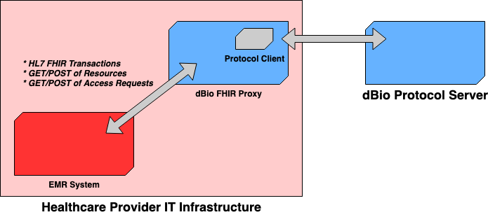
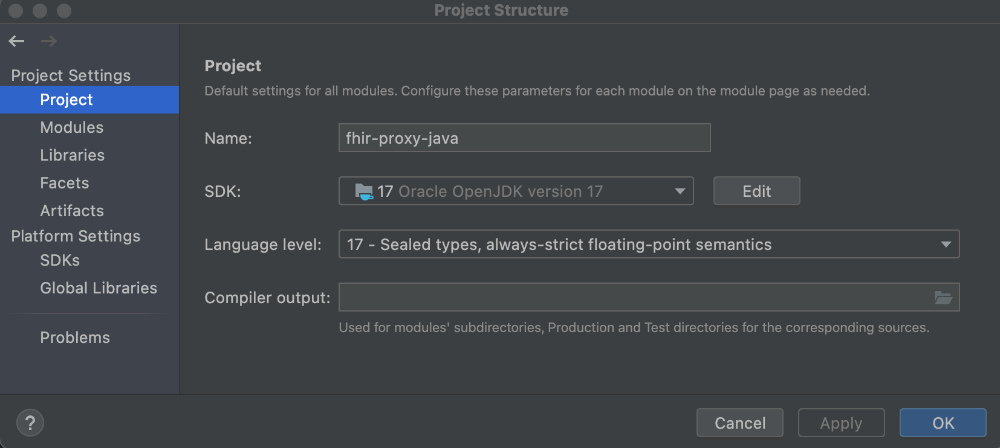
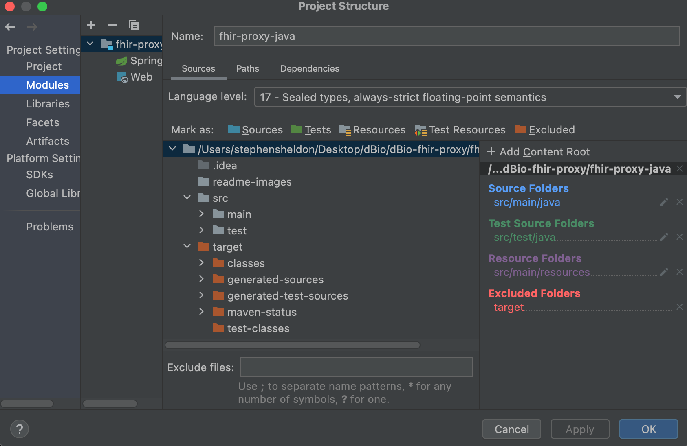
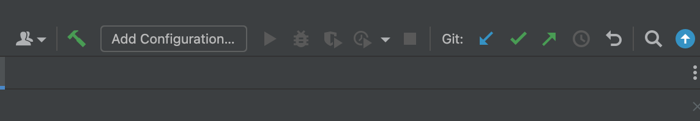
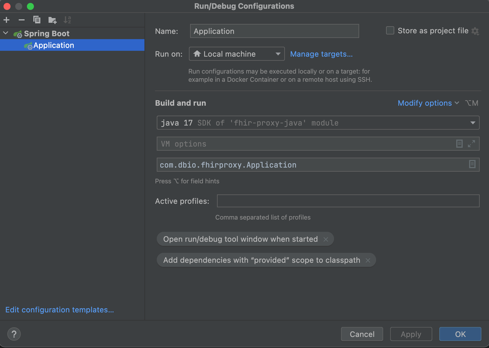

# dBio FHIR Proxy Server

## Purpose

The project consists of a working example implementation of FHIR (Fast Healthcare Interoperability Standard) for the dBio decentralized application. dBio's proxy server builds on top of the [HAPI FHIR](https://hapifhir.io/) project and allows read and write to patients' healthcare data wallets on [web3](https://www.nytimes.com/interactive/2022/03/18/technology/web3-definition-internet.html). This project currently supports 3 FHIR Resource types from the R4 standard (`Patient`, `DiagnosticReport`, `ImagingStudy`) but can be easily extended to more types (see ] Access controls are managed by the `DbioAccessRequest` Resource, which is a custom extension added to facilitate interoperability with the dBio protocol layer.

The FHIR proxy's purpose in the dBio architecture is to serve as a gateway and conduit for interactions with the dBio protocol from within third party infrastructure (e.g. hospitals, universities, clinical research labs). By leveraging the FHIR standard, dBio enables fully extensible and standards compliant interactions with patient data.



## Project Components

### FHIR proxy Java server 
Main code for this server, written in Java with Spring Boot and HAPI FHIR.
Implements HL7 Resources and access controls accessible through the standard FHIR routes over [REST](https://www.hl7.org/fhir/http.html).

To build the Java server use `mvn clean compile` to compile the project, and `mvn clean install` from this repository root to generate a local SNAPSHOT package. The server project depends on `protocol-client` at the SNAPSHOT version, so follow the below instructions to build that its JAR as well.

### protocol-client Scala library
A Scala library subproject contained at `protocol-client` within this repository depending on the `sbt` build tool. This library provides a client with in-built connectivity to the [dbio-protocol](https://github.com/HES-Capstone-dBio/dbio-protocol) server in a Dockerized setting. This library manages the read, write, encryption and decryption of FHIR resources stored in dBio. It also implements access controls used by the FHIR server.

To build the `protocol-client` library, navigate to `./protocol-client` and run `sbt build` to compile and `sbt publishM2` to publish a local JAR for consumption by the Java server.

### Environment variables
A number of environment variables are necessary to successfully run this FHIR server.

* `THIRD_PARTY_EMAIL` -- a shared email address used by the healthcare provider
* `THIRD_PARTY_ETH_ADDRESS` -- Ethereum public address for the provider's wallet
* `THIRD_PARTY_PRIVATE_KEY` -- a private key generated by IronCore (contact dBio maintainers for how to generate a key as there is no other process currently in place).

### Docker image
The final deliverable for this project is a Docker image which comprises the necessary environment variables to run the server. Use this helpful script to quickly bootstrap the necessary Docker image for local development at the `dbio-fhir-proxy:test` tag.

```sh
#!/bin/sh
docker container rm $(docker container ls --all --quiet)
docker image rm dbio-fhir-proxy:test
pushd protocol-client && sbt publishM2 && popd
mvn clean install
docker build . \
  --tag dbio-fhir-proxy:test \
  --build-arg THIRD_PARTY_EMAIL=<your provider email> \
  --build-arg THIRD_PARTY_ETH_ADDRESS=<provider ETH address> \
  --build-arg THIRD_PARTY_PRIVATE_KEY=<provider IronCore private key>
```

## Prerequisites to Development
* The `Java 8` runtime environment such as [OpenJDK 8](https://openjdk.java.net/install/)
* [sbt](https://www.scala-sbt.org/1.x/docs/Setup.html), the Scala build tool, any version above `1.x`. The `sbt` binary is available through `brew`, `nix`, and other popular package managers.
* [maven](https://maven.apache.org/install.html), a build tool for Java.
* A working [Docker](https://docs.docker.com/get-docker/) installation (command line or GUI app) to be able to run the proxy server as a standalone container.
* *Optional:* [IntelliJ IDEA](https://www.jetbrains.com/idea/) to make development in Java easier. IntelliJ also has great support for Scala.

### An important note about computer architectures
A MacOS or Linux computer with the [x86-64](https://en.wikipedia.org/wiki/X86-64) architecture is the default development environment for this project. One of this project's dependencies (IronCore SDK) depends on an architecture-dependent binary to work correctly. There is support for `aarch64` (aka the Mac M1 chip) in this project's Docker image repository (`ssheldharv/dbio-fhir-proxy:latest-aarch64`), but for development on an M1 machine one needs to build the [IronCore SDK](https://github.com/IronCoreLabs/ironoxide-swig-bindings/tree/main/java) from source and replace the binaries in `./protocol-client/bin` with those generated by IronCore.

## Contributing to the Project
New `IResourceProvider` implementations (interfaces for serving Resources) are always welcome, and for the most part they can be cribbed from existing examples in `src/com/dbio/fhirproxy/providers`. Fork this repository, develop a Provider, run the server locally as shown below, and submit a pull request for review by maintaienrs!

## Running the Server Locally

### Using Docker
To use the most recently published image for this server, execute the command `docker run -p 8081:8080 ssheldharv/dbio-fhir-proxy:latest`. To run a locallly built image, use the tag specified in `docker build` for your image. This will launch the FHIR proxy locally accessible at `localhost:8081`. To run this server in the larger context of the dBio application, see [dbio-demo](https://github.com/HES-Capstone-dBio).
*Note:* Commit specific image tags are also available on [Dockerhub](https://hub.docker.com/r/ssheldharv/dbio-fhir-proxy).

### Using Maven

From within the project directory execute the following from the command line:
```bash
mvn clean spring-boot:run -Pboot
```

### Using Intellij IDE

Open the project with the Intellij IDE. Go to File->Project Structure and set the both the SDK and Language level to 17 in the projects tab.




In this same window click on the "modules" tab. Set the language level to 17. Click Apply and then Close.



Next look for the "Add Configurations" button close to the top right of the IDE. Click it to bring up run configurations.



Click the "+" symbol at the top left of this new screen and select "Spring Boot". Configure it as seen in the image below.



Then click "Apply" and "Ok". Your new configuration is now done and you can run it by clicking the run button in the IDE.


## Testing

The server will then be accessible at http://localhost:8080/. To get the server's metadata send a GET request to http://localhost:8080/fhir/metadata. A good way to test this is by using [Postman](https://www.postman.com/downloads/).

